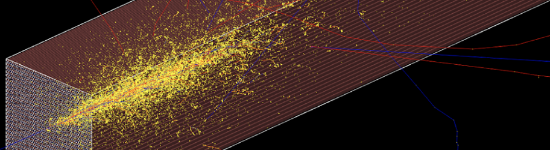

# Introduction to Geant4 course

**A very introductory course intended for developing Geant4 Applications**

<!-- - [La Conga Physics program](https://laconga.redclara.net/en/home/) -->

**[Dr Hernán Asorey](https://github.com/asoreyh/)**, *[Medical Physics Department](http://fisica.cab.cnea.gov.ar/fisicamedica), Centro Atómico Bariloche, Av. E. Bustillo 9500, (8400) San Carlos de Bariloche, Argentina*

## About this course

This is a 4-hours, work-in-progress and hands-on Geant4 course for beginners. We will build two basic applications from scratch: absorbed dose calculation and shielding effects. The course is separated in four sections:
* Introduction: Geant4 Generalities
* Building blocks: structure of an app and common practices
* The basics: simulating physical processes with Geant4
* Apps: build your first Geant4 Applications

## Contents

The [apps](./apps) directory contain two directories intended for:

* [base](./apps/base): base application, mainly developed during the first lecture;
* [final](./apps/final): final application codes, mainly developed during the second lecture.

You will find some root and Geant4 installation scripts and Dockerfiles in the [utils](./utils/) directory.

### Installing Geant4 from scratch

Open your terminal, go to the `utils` directory and then just run: 

```bash
$ ./install-root-geant4.sh
```

### Using docker images

#### Getting the images from my docker hub repository

Alternatively, you can download my updated root and Geant4 docker images from my docker hub repository. Please be sure you have correctly installed docker in your system, and then just pull the images:

```bash
$ docker pull asoreyh/root:latest   # root version 6.28.04 (2023)
$ docker pull asoreyh/geant4:latest # G4 version 10.07.04 (2022)
```

#### Building your own images

Another option is to create your own docker images using the provided `Dockerfiles` in the `utils` directory. Open a terminal, go the `utils` directory and then: 

```bash
docker build -t asoreyh/root:6.28.04 -f Dockerfile.root .
docker build --progress=plain -t asoreyh/geant4:10.07.04 -f Dockerfile.g4 .
```

Of course, feel free to change them according to your need.

#### Run your dockers

You will perform some extra steps to access the Geant4 OpenGL viewer in the docker container from the host computer. Before running the docker, in your terminal just run: 

```bash
$ xhost +local:root
```

and run the Geant4 docker image (if you don’t download the docker images it will download them):

```bash
$ docker run --privileged -it -e DISPLAY=$DISPLAY -v /tmp/.X11-unix:/tmp/.X11-unix asoreyh/geant4:10.07.04
```
(please note you should change the image name if you build and use your own images). 

## Lectures

* First lecture (2h): [Google Slides](https://docs.google.com/presentation/d/1VOZdtuHv4GT2vVAAmoiauFKEVVORfHYiUxqNb3nifQM/edit?usp=sharing)
* Second lecture (2h): [Google Slides](https://docs.google.com/presentation/d/1UU_L1HnBrV7Qb5qRH2Q4eTX34sH_k640uGyBy6TlB4I/edit?usp=sharing)

## License

<p xmlns:cc="http://creativecommons.org/ns#" xmlns:dct="http://purl.org/dc/terms/"><a property="dct:title" rel="cc:attributionURL" href="https://github.com/asoreyh/geant4-course">A very introductory course intended for developing Geant4 Applications</a> by <a rel="cc:attributionURL dct:creator" property="cc:attributionName" href="https://github.com/asoreyh">Hernán Asorey</a> is marked with <a href="http://creativecommons.org/publicdomain/zero/1.0?ref=chooser-v1" target="_blank" rel="license noopener noreferrer" style="display:inline-block;">CC0 1.0 Universal</a></p>
